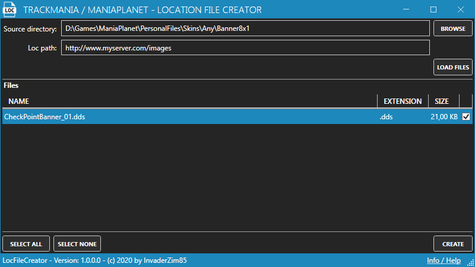

# TrackMania / ManiaPlanet - Location file create

**Content**
<!-- TOC -->

- [History](#history)
- [Installation](#installation)
- [Usage](#usage)

<!-- /TOC -->

## History
| Date | Version | Info |
|---|---|---|
| 2020-06-05 | 1.0.0.0 | Initial |

## Installation
The tool needs no installation. Just download the zip-archive, extract it and run the *LocFileCreator.exe*.

> **Note**: You need the *.NET Framework 4.8* which can you download here: [.NET Framework 4.8 download](https://support.microsoft.com/de-de/help/4503548/microsoft-net-framework-4-8-offline-installer-for-windows)

## Usage
The usage is very easy and should be straight forward. 

Click on *Browse* to select the directory that contains the images you want to create the *loc* file for. After that hit the *Load files* button to load all files, which are stored in the directory (only images files will be loaded).

When you have load the files enter the path / url of your webspace into *Loc path*. For example, when you've upload the images to `http://www.myserver.com/images/`, enter the path into the text box.

When you've loaded the files you will see the list with the files.

Check every file you want to create a loc file for or hit the *Select all* button to select all files.

When you've enter the *Loc path*, selected the desired files hit the *Create* button. Now the tool creates a loc file for every selected image.

> **Note** The create button is only active when you've loaded the files and entered the loc path.

And the content looks like this:

